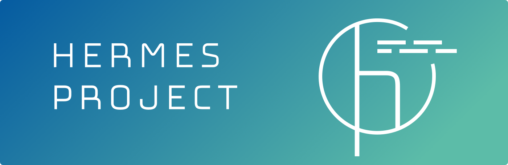
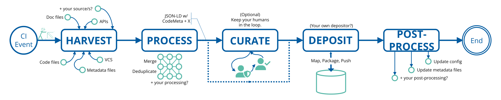

## Welcome

The `softwarepub` organization on GitHub is home to the "HERMES" and "Software CaRD" projects.

### HElmholtz Rich MEtadata Software Publications (HERMES)

HERMES is a language-independent set of tools and practices to help you implement "continuous software publishing", creating publications from your software automatically.

#### Why this is great

A software publication is about creating a publication about the entity the software represents. The software becomes a citable entity, referable in yours and others publications. Furthermore, publishing software promotes

- **Sustainability** -- Foster reuse by visibility, ensure availability, and acquire more funding
- **Reproducibility** -- Document how "I used release/commit xyz for process abc"
- **Academic Credit** -- Especially if your software is not primary subject of publications, created using it
- **FAIR for Research Software** -- [FAIR4RS principles](https://doi.org/10.15497/RDA00068)

#### How HERMES improves Software Publishing

Software publication state of the art works by bridging GitHub with Zenodo and providing several meatadata you wll be able to automatically create a publcation on Zenodo.
This "pull based workflow" is limited by certain factors: code must be accessible, less control over extracted metadata, dependent on single service (Zenodo).

HERMES turns this process upside-down by integrating software publication into your CI/CD pipelines where you define the events, the targets and the scope for your software publication.

#### How it works

The workflow is described in detail in the [hermes](https://github.com/softwarepub/hermes) repository.

You can find a [tutorial](https://docs.software-metadata.pub/en/latest/tutorials/automated-publication-with-ci.html) how to setup HERMES for your project [in our guides](https://docs.software-metadata.pub/en/latest/tutorials/automated-publication-with-ci.html).

#### Is there an example or demo?

An example configuration can be viewed in the [showcase](https://github.com/softwarepub/showcase) repository.

#### Acknowledgements

This project (ZT-I-PF-3-006) was funded by the *Initiative and Networking Fund* of the [Helmholtz Association](https://www.helmholtz.de/en/about-us/structure-and-governance/initiating-and-networking) in the framework of the [Helmholtz Metadata Collaboration](https://helmholtz-metadaten.de/)'s [2020 project call](https://helmholtz-metadaten.de/en/inf-projects).
Development now continues as a joined community effort.

### Software Curation and Reporting Dashboard (Software CaRD)

In the HERMES workflow humans shall be kept in the loop:
Metadata curation, publication approval and evaluation processes require human interaction and should be supported by graphical user interfaces.

We create "Software CaRD", an open source application that presents software publication metadata for curation.
Preprocessed metadata from automated pipelines are made accessible in a structured graphical view, with highlighted issues and conflicts.
Software CaRD also assesses metadata for compliance with configurable policies, and lets users track and visualize relevant metadata for evaluation and reporting.

We are just getting started with this project! (2024-07-01) Stay tuned for more!
